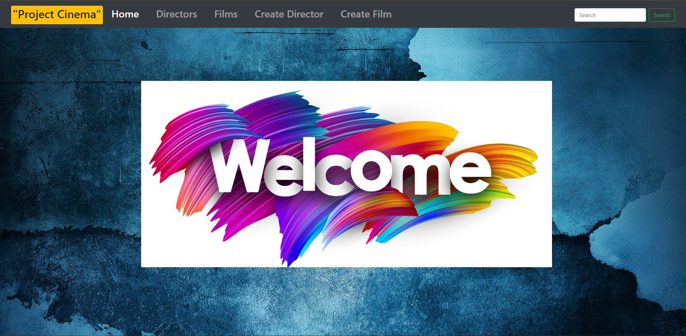

# JavaMastery (Cinema)
## Немного о приложении:
В данном приложении осуществяется поиск в базе данных информации о режиссерах и созданных ими фильмах.
Информация храниться в реляционной БД PostgreSQL.
Предоставляется возможность ввода критериев поиска по средством уникального идентификатора режиссера (id).
Ввод критериев поиска реализован в виде HTML страницей в браузере.
Приложение возвращает информацию о найденном в БД режиссере и его фильмах.
Результаты поиска предоставляются по средсвом вывода в HTML страницы в браузере.
Реализован web user interface, а также добавлены unit тесты.

## Заполнение БД PostgreSQL:
1. Скачать и установить БД PostgreSQL, если она у вас не установленна.
2. Создать новую базу данных под названием "Cinema".
Далее есть два варианта создания объектов БД и их заполнение:

Вариант 1:
Правой кнопкой мыши нажимаем по созданной БД и выбираем "Восстановить..." --> Формат оставляем специальный 
--> Имя файла, нажиаем "..." и находим в корне проекта файл "Cinema_backup_All.backup" по пути "src/main/resources/Cinema_backup_All.backup"
--> Далее нажимаем на вкладку "Параметры восстанавления" и в "Секции" меняем все галочки на "да" (чтобы создать все объекты и их заполнить)
--> После этого нажимаем на кнопку "Восстановить".

Вариант 2:
Находим в корне проекта файл "Cinema Database.sql" по пути src/main/resources/Cinema Database.sql --> копируем всё его содержимое
--> Правой кнопкой мыши нажимаем по созданной БД и выбираем "Запросник..." --> вставляем в него скопированные SQL скрипты 
--> Нажимаем кнопку "Execute/Refresh (F5)"

## Работа в приложении:
- Заходите в класс ServingWebContentApplication.java по пути: src/main/java/by/bolotko/ServingWebContentApplication.java;
- Запускаете его;
- Далее запускаете БД PostgreSQL (если она до этого не была запущена);
- В браузере открываете новую ссылку и прописываете http://localhost:8080/
Всего есть 5 вкладок и строка поиска:

Home - вернуться на главную страницу;

Directors - выводит всех режиссеров которые есть в БД;

Films - выводит все фильмы которые есть в БД;

Create Directir - вкладка для создания нового режиссера;

Create Film - вкладка для создания нового фильма;

Search - вводите id режисёра которого нужно найти (в самом начале от 1 до 7).

## Хорошего вам дня :)
